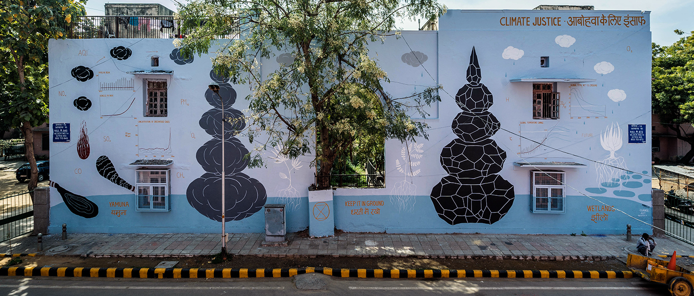
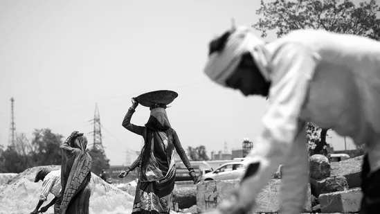

## Working Papers

 **Barriers within Borders: Climate Change, Market Barriers,
and the Reversal of Structural Transformation** **[DRAFT AVAILABLE ON REQUEST]**

::::: columns
::: {.column width="65%"}

Abstract

 This paper examines how climate change is hindering structural transformation in India and the role of internal trade barriers in it. I combine local temperature effects on productivity, consumption, and labor shares with a static spatial equilibrium model to evaluate the potential for labor reallocation out of agriculture as an adaptation to climate change. My empirical findings show that temperature has a more negative impact on agricultural productivity than on manufacturing (supply-side effect), and household expenditure on food increases as incomes fall, consistent with Engel’s law (demand-side effect). Rising temperatures also increase the agricultural labor share, hindering structural transformation. Districts in India could mitigate against the adverse effects of declining agricultural productivity through inter-district trade. Using a market access variable created by using development of Indian highways, I find that improved market access does not disrupt the positive relationship between temperature and agricultural labor share. I find that trade barriers reduce spatial competition among buyers and traps labor in low-productivity agriculture. I then calibrate a spatial equilibrium model with internal trade barriers to Indian data. Counterfactual analysis reveals that removing state-level trade barriers in Indian agriculture will increase income by 4.65% on average for each household and decrease agricultural labor share by 0.1pp on average for each district (\~ 28.9 million people across India).

:::

::: {.column width="35%"}
{width="200"}
:::
:::::

 **Stumped by the Sun, Saved by the Side: Estimating the role of peer and adversarial effects in adaptation to heat** **[DRAFT AVAILABLE ON REQUEST]**

::::: columns
::: {.column width="65%"}

Abstract

 Literature has conclusively established that temperature has negative impact on individual's labor productivity. However we rarely work in isolation, most jobs require working with peers or against an adversary. This paper provides first estimates of the magnitude of peer and adversarial effect on individual's productivity under heat. Utilizing rich data, institutional details, and team dynamics of the sport of cricket, I find that even though temperature affects individual's productivity negatively, it doesn't have any effect on equilibrium outcomes that are affected by peers and adversaries. If individuals are negatively affected by heat but there's no effect on equilibrium outcome, the only two explanations could be an increased peer effect under heat or a decreased adversarial effect. A further analysis reveals that peer effect increases significantly at temperature above 25C while adversarial effect has no significant difference between games played below 25C and above 25C temperature. These peer effects accrue through complementarity of skill-set among peers which creates opportunity for learning at higher temperature. This finding shows that even when workers are individually affected negatively by temperature, they can adapt in team settings through positive peer effect given complementary skills exist among peers.

:::

::: {.column width="35%"}
{width="200"}
:::
:::::

## Works in progress

-   Quantifying the global trade leakage under the EUDR policy (with [Matthieu Stigler](https://matthieustigler.github.io))

-   Climate Change and Mechanization of Agriculture in India (with [Bhavya Srivastava](https://www.bhavyasrivastava.com))

-   Climate Change and Informal Insurance Networks (with [Matthew Gordon](https://sites.google.com/view/mdgordon/home))

## Book Chapters

-   [Understanding the Gender Gap in Education and Employment](https://www.cambridge.org/core/books/abs/colossus/education-understanding-the-gender-gap-in-education-and-employment/163763A3D320223894A3E7F31DFD46D4) Chapter in *Colossus : The anatomy of Delhi ,* edited by Sanjoy Chakravorty and Neelanjan Sircar. Cambridge University Press (2021) (with Deepaboli Chatterjee and Babu Lal)
